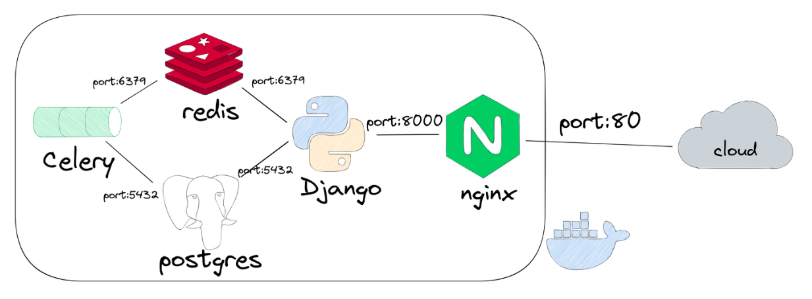

## Django using celery 

### Architecture



### Process

#### 1. create django project & application

* requirements.txt
    ```
    django

    djangorestframework
    markdown
    django-filter

    celery[redis]

    psycopg2-binary
    ```

* create django project
    ```
    python -m venv .venv 
    source .venv/bin/activate 
    django-admin startproject backend
    ```

* create django application
    ```
    cd backend
    python manage.py startapp assignments
    ```

#### 2. do settings & implement models

* edit `settings.py`
    ```python
    INSTALLED_APPS = [
    "django.contrib.admin",
    "django.contrib.auth",
    "django.contrib.contenttypes",
    "django.contrib.sessions",
    "django.contrib.messages",
    "django.contrib.staticfiles",
    "assignments",
    "rest_framework",
    ]
    ```

* impelment `assignments/models.py` and then, 
    ```
    python manage.py makemigrations
    python manage.py migrate
    ```

* implement `assignments/serializers.py` and `assignments/views.py`

#### 3. implement celery

* implement `assignments/tasks.py`

#### 4. implement django urls

* implement `assignments/urls.py` and `backend/urls.py`

#### 5. configure celery 

* implement `backend/celery.py`, `backend/celery.py`, and `backend/__init__.py`

* edit `settings.py`
    ```python
    CELERY_BROKER_URL = "redis://localhost:6379/0"
    CELERY_RESULT_BACKEND = "redis://localhost:6379/0"
    ```

#### 6. implement dockers

#### 7. execute

```python
docker-compose build
docker-compose up
```

### references
* https://saasitive.com/tutorial/django-celery-redis-postgres-docker-compose/